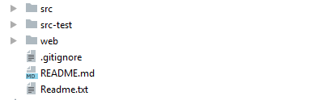

# Documentation développeur

## Installation de Tomcat Apache Server  (Version 9.0)
[Tomcat 9.0](https://tomcat.apache.org/download-90.cgi)

Dézippez l'archive correspondant à votre système à l'endroit voulu et vous aurez votre installation d'Apache Tomcat Server prête à être utilisée !

## Récupération et lancement du projet à travers l'IDE IntelliJ

IntelliJ IDEA est un IDE Java commercial développé par JetBrains. Il est une alternative payante à Eclipse et c'est celui qui a été utilisé dans le cadre de ce projet.

### Récupération du projet à travers GitHub

On crée un nouveau projet à partir d'un logiciel de contrôle de version (ici, GitHub)

On choisit le répertoire GitHub dans lequel se trouve le projet de Tableau blanc :
[Répertoire du Tableau Blanc](https://github.com/TelecomLille/ILOG2017.git)

On choisit aussi à quel endroit sera créé le projet ainsi que le nom du dossier qui l'accueillera.

Ensuite, on lance le clonage et on attend qu'il se finisse (cela peut prendre quelques minutes).

Bien sûr, nous sommes sur la branche master (par défaut) du répertoire Git et notre projet est situé dans une autre branche : whtbrd.
Il faut donc indiquer à IntelliJ qu'on souhaite se positionner sur cette branche.

Il suffit alors d'accepter qu'une branche locale soit créée sous le nom de la branche distante et le tour est joué. Si vous retournez dans le menu des « Branches », vous devriez voir ceci :

Cela indique que vous êtes positionné sur la branche whtbrd.
Il ne vous suffit plus alors qu'à effectuer un fetch sur cette branche pour récupérer l'ensemble du projet de tableau blanc.
Cette fonctionnalité se situe dans VCS → Git → Fetch. 
Votre projet devrait donc présenter les dossiers suivants :

### Vérification de la configuration du projet

Avant de continuer, il faut vérifier que le projet soit correctement configuré.

Notamment qu'il possède bien un chemin où stocker les fichiers compilés!

### Création d'une configuration de lancement Tomcat

Créez la nouvelle configuration suivante: Tomcat Server -> Local
Appuyez sur le bouton "Configure..." sur la page Server qui vient de s'ouvrir.

Ajouter les deux librairies indiquées qui sont présentes dans le dossier lib de Tomcat.

### Ajouter les librairies nécessaires au projet

Dans File → Project Structure → Libraries:

Bibliothèque GSON disponible ici : [GSON.jar](https://github.com/google/gson)
Les deux autres bibliothèques se trouvent dans le dossier lib de Tomcat.

### Création d'un artefact web application exploded

Un artefact est un élément spécifique issu de la construction du logiciel. 

Dans Java, les artefacts les plus communs sont des JARs, mais ce peut être aussi un fichier WAR, un EAR, un ZIP, etc. 

On va se servir d'un artefact pour pouvoir lancer notre application avec Tomcat.

Un artefact de type application web exploded signifie qu'au lieu d'aller chercher les fichiers nécessaires au fonctionnement de l'application dans un fichier .war, on va les chercher dans un dossier qui correspondrait à ce qu'il y aurait dans une version dézippée (exploded) du .war. 

Ainsi, une modification des fichiers se reflète instantanément sur l'application en cours d’exécution et cela est plus rapide dans un cadre de test/développement d'application.

A chaque changement dans les fichiers de l'application, il suffira juste de redéployer l'artefact et non pas redémarrer le serveur en entier. On a alors un gain de temps.

Pour créer notre artefact, nous avons besoin de créer un web facet qui nous permettra d'indiquer à l'artefact où se trouve les fichiers web du projet.

On va pour cela aller dans File → Project Structure → Facets:

Il suffit de rajouter un descripteur correspondant à Tomcat, de vérifier que le Web Resource Directory est le bon (le dossier web doit être celui à la racine du projet) et de cocher le dossier "src" en Source Roots.

S'il n'y a pas de Source Roots, retournez dans le menu du projet, faites un clic droit sur le dossier "src" et sélectionnez l'option suivante:

Une fois cela fait, on peut créer l'artefact.

Dans File -> Project Structure -> Artefacts:

Et on lui ajoute en sortie le web facet créé ainsi que le dossier WEB-INF:

### Rajout de l'artefact à déployer dans Tomcat

L'artefact est maintenant créé mais il faut indiquer au serveur Tomcat qu'il doit l'utiliser.
On retourne donc dans sa configuration de lancement.

Et on lui rajoute l'artefact dans la page "Deployment".

### Lancement du serveur Tomcat

Il ne reste plus qu'à lancer le serveur Tomcat avec la configuration créée!

Une fois que le serveur Tomcat aura fini de se lancer, la page de connexion du projet s'ouvrira! (Celle-ci étant indiquée dans les fichiers XML du projet comme étant la page d'index)

### Contenu du projet

### Export du projet

## Comment faire sur d'autres IDE? Plus d'informations sur Tomcat? Comment améliorer l'application?

Vous trouverez ici un cours sur le développement d'une application web avec Java EE au lien suivant:

[Tutoriel Application Web Java EE](https://openclassrooms.com/courses/creez-votre-application-web-avec-java-ee/outils-et-environnement-de-developpement)

Vous y trouverez plus d'informations sur Java EE, le fonctionnement de Tomcat, son installation sous Eclipse et des tutoriels pour créer de nouveaux fichiers pour l'application (servlets, jsp, ...)

De plus, si vous avez quelques difficultés avec Git, vous pouvez consulter le tutoriel au lien suivant qui vous expliquera comment fonctionne l'outil de versioning:

[Tutoriel Git](https://openclassrooms.com/courses/gerer-son-code-avec-git-et-github/qu-est-ce-que-versionner-son-code)