# Documentation Utilisateur

## Lancement de l'application

Vous trouverez l'application au lien suivant:
[WhiteBoard](export/whtbrd.war)

Elle est contenue dans un fichier .war.

Pour pouvoir l'exécuter, il vous faut installer à la fois Java ainsi que Tomcat Apache Server.

### Installation de Java

Afin que l'application puisse fonctionner, il est nécessaire d'avoir installé la version 8 du JRE de Java:
[JRE Java 8](http://www.oracle.com/technetwork/java/javase/downloads/jre8-downloads-2133155.html)

Il faut aussi indiquer dans vos variables environnement système le chemin vers son dossier "bin".

[Configuration ou modification de la variable système PATH](https://www.java.com/fr/download/help/path.xml)

### Installation de Tomcat Apache Server  (Version 9.0)

[Tomcat 9.0](https://tomcat.apache.org/download-90.cgi)

Dézippez l'archive correspondant à votre système à l'endroit voulu et vous aurez votre installation d'Apache Tomcat Server prête à être utilisée !

### Importation de l'application dans Tomcat

Une fois l'application téléchargée, vous devez placer votre fichier .war dans le dossier webapps de Tomcat.

Au lancement de Tomcat, celui-ci se chargera d'extraire les fichiers de l'application dans ce dossier et de lancer l'application.

### Lancement de Tomcat en local

Pour lancer votre serveur Tomcat local, il vous suffit d'exécuter startup.bat situé dans son dossier "bin".

Par défaut, le serveur Tomcat renvoie à l'url suivante: 
[localhost:8080/](localhost:8080)

Pour accéder à l'application, il vous suffit d'aller à l'url suivante:
localhost:8080/{Nom du fichier .war (Sans le .war)}

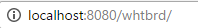

## Présentation de l'application

### Présentation générale

L'application ici-présente est un tableau blanc partagé.

Cela signifie que des utilisateurs peuvent créer un ou plusieurs tableaux blancs qu'ils peuvent partager avec d'autres utilisateurs en ligne.

Sur chaque tableau blanc, les utilisateurs peuvent dessiner simultanément sur une même zone de dessin et celle-ci sera partagée avec l'ensemble des utilisateurs présents sur le tableau.

### La page de connexion

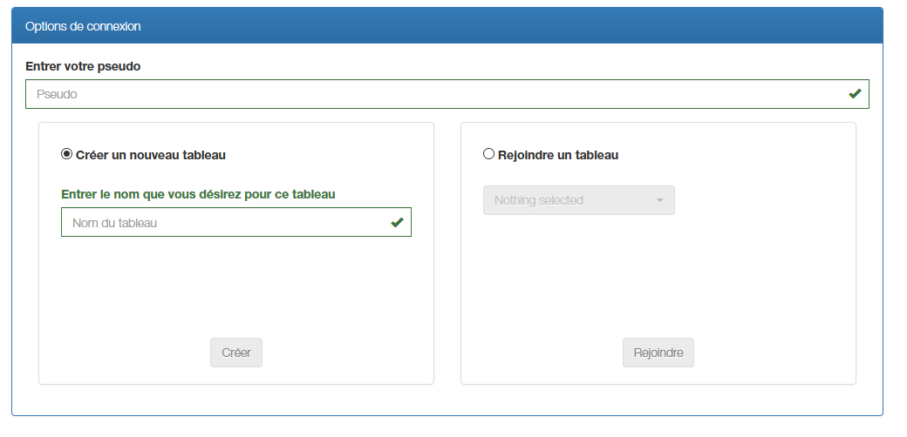

Vous pouvez remarquer que la page de connexion possède 3 blocs distincts:

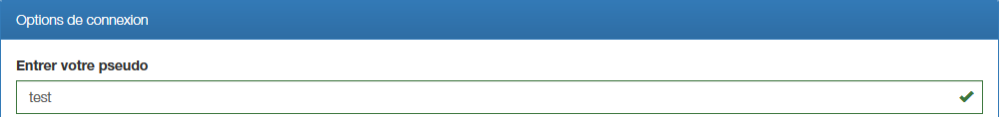

Ce bloc vous permet de choisir votre nom d'utilisateur.

Ce nom est libre de choix dans la limite où il ne faut pas que deux utilisateurs aient le même nom sur un même tableau blanc.
Dans ce cas de figure, vous ne pourrez pas accéder au tableau blanc demandé et il vous faudra changer de nom.

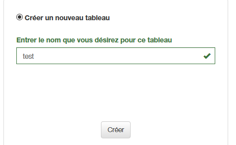

Ce bloc vous permet de choisir votre nom de tableau blanc.

Ce nom est aussi libre de choix dans la limite où il n'existe pas de tableau blanc avec le même nom.
Dans ce cas de figure, il vous faudra choisir un autre nom.

Aussi, il n'est pas possible de créer un tableau blanc si vous n'avez pas choisi de nom d'utilisateur au préalable.

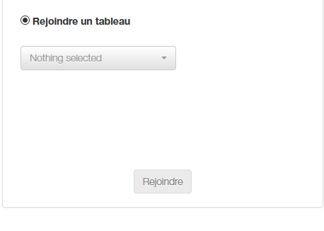

Ce bloc vous permet de choisir de rejoindre un tableau blanc déjà existant.

Si aucun tableau blanc n'a été créé, la sélection sera vide et vous ne pourrez pas rejoindre de tableau.

Dans ce cas de figure, il vous faut créer un nouveau tableau blanc.

Une fois que vous aurez cliqué sur le bouton "Créer" ou "Rejoindre", vous serez redirigé vers le tableau blanc correspondant.

### Le tableau blanc

## Contenu

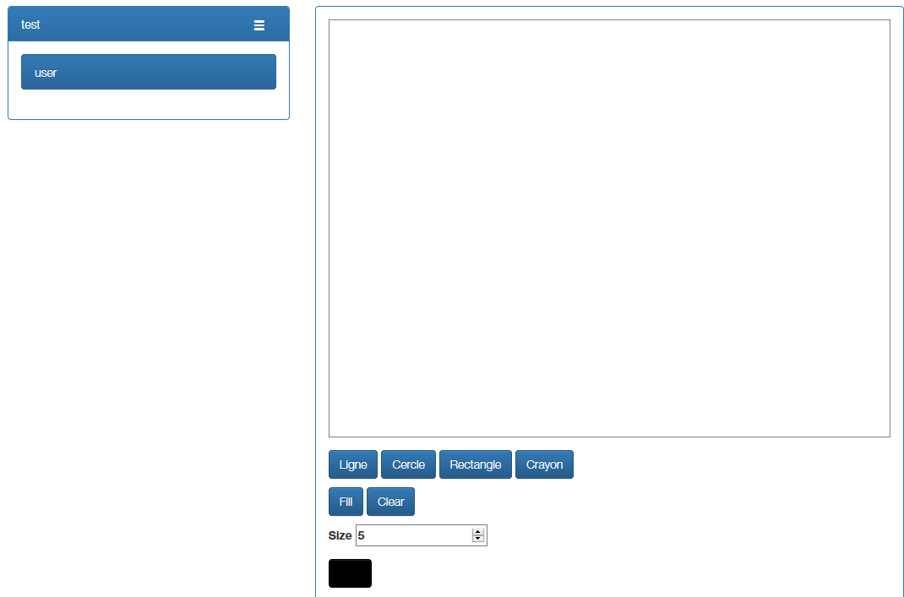

Vous pouvez remarquer que le tableau blanc possède 2 blocs distincts lui aussi:

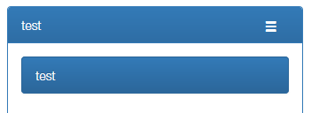

Ce bloc affiche les informations relatives au tableau blanc: le nom du tableau blanc ainsi que les utilisateurs connectés.
L'icône à droite du nom du tableau permet de revenir à tout moment à la page de connexion.

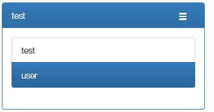

S'il y a plusieurs utilisateurs sur un même tableau, votre nom d'utilisateur sera celui sélectionné en bleu.

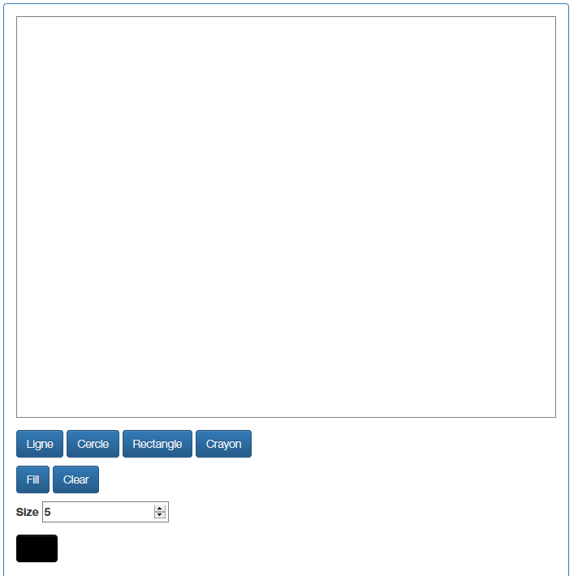

Ce bloc représente la zone de dessin (Cadre blanc) ainsi que les options disponibles de dessin.

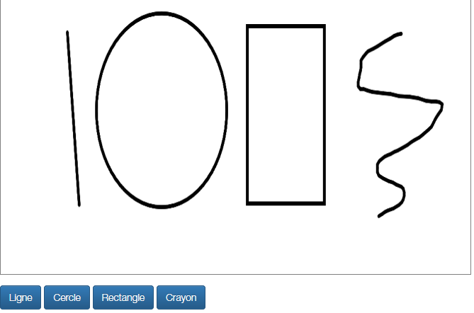

La première ligne d'options concerne les types disponibles pour dessiner.

On a successivement la ligne, le cercle, le rectangle et le dessin à main levé.
Il suffit de sélectionner le type voulu et de le dessiner sur le canvas.
Le type sélectionné restera le même tant que vous n'aurez pas sélectionné un autre type.

Tant que vous ne relâchez pas votre souris (à l'exception pour le dessin à main levé), vous pouvez avoir un aperçu du résultat et adapter celui-ci en conséquence.

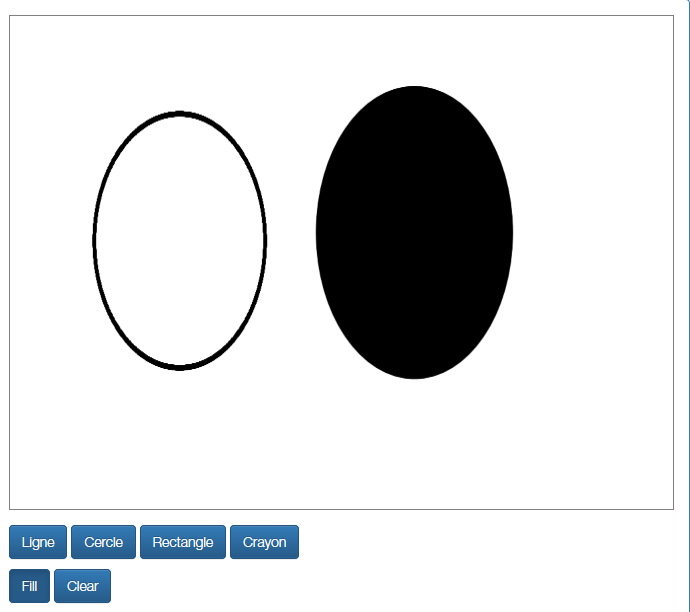

La deuxième ligne d'options possède les commandes "Fill" et "Clear".

Quand "Fill" est sélectionné, les formes (Cercle & Rectangle) sont maintenant remplies.
Le déselectionner permet d'avoir à nouveau des formes creuses.

Quand on clique sur "Clear", la zone de dessin s'efface en intégralité.

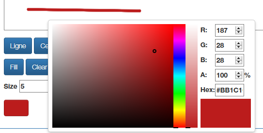

La dernière ligne vous permet de sélectionner une couleur pour vos prochains dessins sur la zone.

Celle-ci restera la même tant que vous n'aurez pas sélectionné une autre couleur.

## Synchronisation à plusieurs utilisateurs

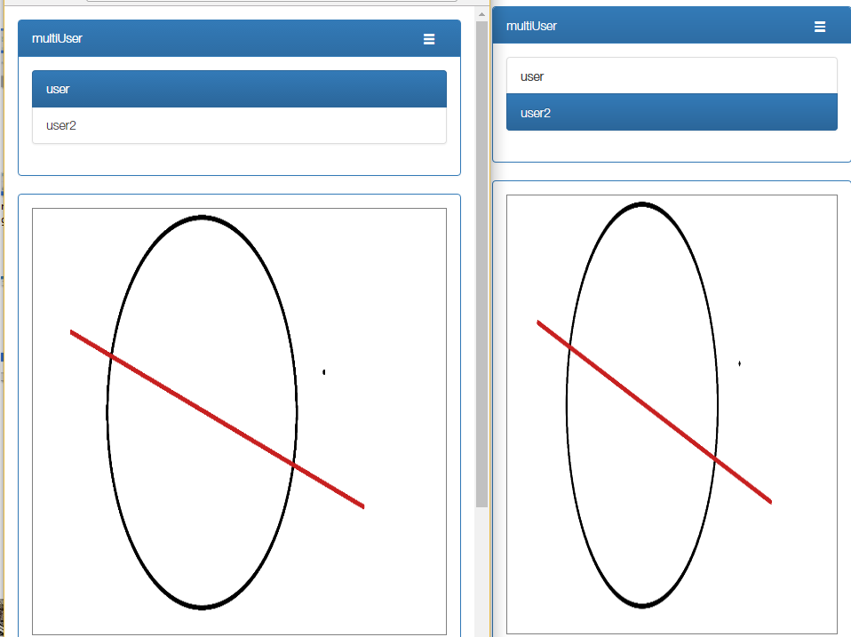

La synchronisation du tableau blanc entre les différents utilisateurs se fait toutes les 500 ms.

Dans un cas où il y aurait beaucoup plus de tableaux blancs et d'utilisateurs connectés, ce temps de synchronisation pourrait être rallongé.

