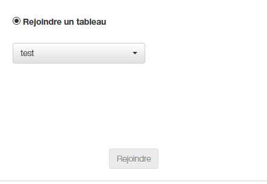

# Documentation Utilisateur

## Lancement de l'application

### Installation de Java

Afin que l'application puisse fonctionner, il est nécessaire d'avoir installé la version 8 du JRE de Java:
[JRE Java 8](http://www.oracle.com/technetwork/java/javase/downloads/jre8-downloads-2133155.html)

Il faut aussi indiquer dans vos variables environnement système le chemin vers son dossier "bin".

[Configuration ou modification de la variable système PATH](https://www.java.com/fr/download/help/path.xml)

### Installation de Tomcat Apache Server  (Version 9.0)
[Tomcat 9.0](https://tomcat.apache.org/download-90.cgi)

Dézippez l'archive correspondant à votre système à l'endroit voulu et vous aurez votre installation d'Apache Tomcat Server prête à être utilisée !

### Importation de l'application dans Tomcat

### Lancement de Tomcat

Pour lancer votre serveur Tomcat, il vous suffit d'exécuter startup.bat situé dans son dossier "bin".
Par défaut, le serveur Tomcat renvoie à l'url suivante: 
[localhost:8080](localhost:8080)

## Présentation de l'application

### Présentation générale

(A Faire)

### La page de connexion

Vous pouvez remarquer que la page de connexion possède 3 blocs distincts:

Ce bloc vous permet de choisir votre nom d'utilisateur.

Ce nom est libre de choix dans la limite où il ne faut pas que deux utilisateurs aient le même nom sur un même tableau blanc.
Dans ce cas de figure, vous ne pourrez pas accéder au tableau blanc demandé et il vous faudra changer de nom.

Ce bloc vous permet de choisir votre nom de tableau blanc.

Ce nom est aussi libre de choix dans la limite où il n'existe pas de tableau blanc avec le même nom.
Dans ce cas de figure, il vous faudra choisir un autre nom.

Aussi, il n'est pas possible de créer un tableau blanc si vous n'avez pas choisi de nom d'utilisateur au préalable.

Ce bloc vous permet de choisir de rejoindre un tableau blanc déjà existant.

Si aucun tableau blanc n'a été créé, la sélection sera vide et vous ne pourrez pas rejoindre de tableau.
Dans ce cas de figure, il faut créer un nouveau tableau blanc.

Une fois que vous aurez cliqué sur le bouton "Créer" ou "Rejoindre", vous serez redirigé vers le tableau blanc correspondant.

### Le tableau blanc

Si le nom de tableau est déjà pris, vous ne pourrez pas créer votre tableau.